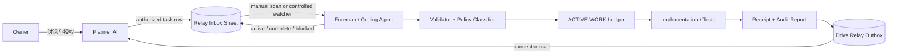

# Delos Relay：让规划型 AI 与 Coding Agent 不再靠人肉复制粘贴

Relay 是一个轻量的“施工控制面”：一个 AI 负责讨论需求、拆任务和验收，另一个 coding agent 负责读仓库、写代码、运行测试和交付结果。两边通过一张 Google Sheet 和一组收据文件交换结构化任务，不再让人类来回复制几千字 prompt 与施工报告。

这份教程来自一个真实的个人 AI companion 工程实践，但已经做了隐私清理。它保留架构、权衡、实现步骤和踩坑经验，不包含私人对话、身份 prompt、机器路径、云端文件 ID、token 或仓库秘密。你可以保留 `Delos Relay` 这个名字，也可以替换成自己的命名。

> Relay 不是“让两个 AI 随便互相聊天”。它是一条有 schema、状态机、审批边界、幂等键、冲突检测和审计收据的施工通道。

## 它解决什么

没有 Relay 时，工作流通常是：

```text
在规划 AI 里讨论需求
→ 人类复制 prompt
→ 粘贴给 coding agent
→ 等 coding agent 施工
→ 人类复制几千字报告
→ 粘贴回规划 AI
→ 再复制修正意见
```

Relay 把它变成：

```text
Planner 写入一行 authorized task
→ Foreman 读取、验证、分类并执行
→ 状态回写同一行
→ 报告写入 Outbox
→ Planner 直接读取并审计
```

人类仍然拥有最终控制权，但不再充当剪贴板。

## 先理解三个角色

- **Owner**：真正拥有机器、仓库、账号和最终决定权的人。
- **Planner**：与 Owner 讨论产品、写结构化工单、读取交付物并验收的 AI。
- **Foreman**：唯一施工协调者。它刷新现场、维护工作账本、调用 coding agent、集成改动并写收据。

角色可以由不同产品承担。Relay 不要求特定模型，也不要求把人格系统接进施工系统。

## 总体架构



最小可用版本不需要 daemon、端口或 webhook。Foreman 在被唤醒时手动扫一次 Sheet 即可。这样已经消除了长文本双向搬运，只保留一句“查收 Relay”的门铃。自动 watcher 可以以后再加，但它是新的常驻服务与授权面，不应偷偷混进 MVP。

## 组件清单

```text
Google Drive/
└── Relay/
    ├── Relay-Inbox          # 原生 Google Sheet
    └── Relay-Outbox/        # Planner 可检索的审计报告

~/relay/
├── inbox/                   # 已验证、待处理 packet
├── processed/               # 完成或阻塞后的 packet
├── receipts/                # 机器可读收据
├── outbox/                  # 人类可读报告
├── bin/                     # validator / ingest / explain
├── policy.md                # 持久审批规则
├── README.md                # Foreman 操作手册
└── KILL                     # 存在即全局拒绝施工；默认不存在
```

项目还应保留一个唯一工作账本，例如 `ACTIVE-WORK.md`。它记录 task ID、基线、filescope、冲突集、状态与恢复方式。不要再建第二本“差不多一样”的账。

## 为什么选择 Google Sheet

Sheet 不是唯一选择，但很适合个人工作流：

- 手机和网页都能查看；
- Planner connector 容易读取和更新；
- Foreman 可通过 Google Sheets API 或 rclone 导入/导出；
- 每个任务天然占一行，适合 owning-row 更新；
- 出问题时，人类能直接看见状态。

替代方案包括私有 GitHub Issues、数据库、消息队列或本地 MCP。无论换什么传输层，都应保留本文的 schema、幂等、审批与收据原则。

## 权限：优先使用最小 Drive scope

若用 rclone 连接 Google Drive，优先评估 `drive.file`：它只能访问由该 app 创建或明确授权给该 app 的文件，而不是扫描整个 Drive。Google 也将 `drive.file` 描述为按文件授权的较小权限范围。

```bash
rclone config
```

配置时选择 Google Drive，并为 Relay remote 选择 `drive.file`。长期使用建议创建自己的 OAuth client ID，不要把 token、client secret 或 `rclone.conf` 提交到 GitHub。

重要限制：`drive.file` 下，rclone 通常看不到你在网页里手工创建、且从未授权给该 app 的文件；反过来，rclone 创建的文件在 Drive 网页中可见。部署前必须实测两个方向：

1. Foreman 创建的 Sheet，Planner connector 能否读取和更新？
2. Planner 或人类创建的文件，Foreman 的窄权限 app 能否看见？

不要根据“都在同一个 Drive”就假设一定互通。

参考：

- [rclone Google Drive 文档](https://rclone.org/drive/)
- [Google Drive API scopes](https://developers.google.com/workspace/drive/api/guides/api-specific-auth)
- [Google Sheets values.update](https://developers.google.com/workspace/sheets/api/reference/rest/v4/spreadsheets.values/update)

## 第一步：建立 Relay Inbox

推荐列：

| 列 | 用途 |
|---|---|
| `task_id` | 全局唯一任务 ID |
| `status` | `authorized / active / complete / blocked` |
| `updated_by` | `planner / foreman / owner` |
| `schema_version` | packet schema 版本 |
| `idempotency_key` | 规范化任务正文的 SHA-256 |
| `from` | 工单来源 |
| `approval_level` | `auto / ask-owner / design-only` |
| `title` | 简短标题 |
| `base_expect` | 期望 Git SHA；非代码任务可空 |
| `filescope` | 允许触碰的路径 JSON 数组 |
| `excluded` | 明确禁止范围 |
| `gates` | 测试、构建、部署等门禁 |
| `stop_conditions` | 触发即 BLOCKED 的条件 |
| `body` | 完整施工说明 |
| `receipt_to` | 交付位置 |
| `created_at` | ISO 8601 时间 |
| `receipt_hash` | 最终报告 SHA-256 |
| `receipt_at` | 完成时间 |
| `error` | 有界错误摘要 |

可以先做一个 CSV，再让 rclone 导入为原生 Google Sheet：

```bash
rclone copyto relay-inbox.csv \
  relay-drive:Relay/Relay-Inbox.csv \
  --drive-import-formats csv \
  --drive-export-formats csv
```

rclone 默认不会自动做有损格式转换，因此需要显式指定 import format。上传后再导出一次，逐单元格对照，确认 header、引号、换行与空值没有漂移。

## 第二步：定义 Task Packet

下面是脱敏示例。实际存储可以是 Sheet 行、YAML、JSON 或三者之间的确定性投影。

```yaml
schema_version: 0
task_id: DEMO-20260719-001
idempotency_key: sha256:<normalized-body-hash>
from: planner
approval_level: auto
title: Add bounded status command
base_expect: 0123abc
filescope:
  - src/status/**
  - tests/status/**
excluded:
  - production credentials
  - identity prompts
  - database migrations
gates:
  - fresh baseline
  - targeted tests
  - full typecheck
stop_conditions:
  - base drift
  - filescope conflict
  - permission expansion required
body: |
  Inspect the existing status command and add one bounded field.
  Preserve unrelated output byte-for-byte.
receipt_to: outbox
```

### 一张好工单应该回答什么

- 要改变什么可观察行为？
- 当前事实与期望基线是什么？
- 哪些文件能动，哪些绝对不能动？
- 必须通过哪些测试？
- 哪些情况出现时必须停止，不得“自行理解后继续”？
- 是否授权 commit、集成或 live deploy？
- 收据必须包含哪些证据和回滚方式？

不要把密码、OAuth token、私人 prompt 或完整 transcript 塞进 packet。只放指针、哈希和经过清洗的必要说明。

## 第三步：实现 Validator

Validator 必须在写账本、建分支或执行任何命令之前运行。至少检查：

```text
schema 合法
task_id 与 idempotency_key 合法且未冲突
status == authorized
filescope / excluded 是有效数组
没有 secret、token、密码或私密正文
没有与 active task 重叠的 filescope
base_expect 与当前基线一致
KILL 文件不存在
approval_level 没有越权
```

建议把结果做成可解释对象，而不是一个布尔值：

```js
{
  decision: "AUTO" | "ASK_OWNER" | "BLOCKED",
  rule_id: "AUTO_BOUNDED_CODE",
  reasons: ["filescope bounded", "base matches"],
  packet_hash: "sha256:..."
}
```

### 不要用 shell 解析 Sheet

错误示范：

```bash
eval "$(cut -d, -f15 relay.csv)"
```

正确方向：

- 使用真正的 RFC 4180 CSV parser；
- 单元格永远作为数据，不作为命令；
- 不执行公式；
- 使用 Sheets API 时优先 `valueInputOption=RAW`；
- 对以 `=`, `+`, `-`, `@` 开头的外部输入做拒绝或惰性化；
- 不把任意 Sheet 内容拼进 shell command。

## 第四步：状态机与 owning-row

最小状态机：

```text
proposed → authorized → active → complete
                           └──→ blocked
```

关键规则：

1. Foreman 只消费 `authorized` 行。
2. 接单时把同一行推进到 `active`，并写入接单哈希。
3. 完成后只更新这张任务自己的行。
4. 写回前同时匹配 `task_id + idempotency_key + 当前 status`。
5. 若 owning-row 已被别人改动，停止，不要覆盖。
6. crash/retry 时先查 receipts 与 processed；同一幂等键不能施工两次。

不要通过“找到第一个 active 行”来更新状态，也不要用模糊标题匹配。标题可以重复，task ID 不可以。

## 第五步：审批分级

以下是一个适合个人项目的 Option B 示例。它不是唯一正确答案，应按你的风险偏好调整。

### AUTO

- 只读检查、审计、测试、typecheck、build；
- filescope 内的项目记录、文档和既有控制面 Sheet；
- filescope 内的有界代码修改；
- 工单明确授权的 commit、rollback tag、规定好的 rebase 与 ff-only 集成。

### ASK_OWNER

- live deploy、重启服务、换线上进程；
- 删除数据、删 ref、force、历史改写、不可逆迁移；
- 密码、OAuth、权限扩张、付费服务；
- 新 daemon、端口、webhook、watcher 或外部 agent；
- 以 Owner 身份对外发送或发布；
- 身份、关系、亲密 prompt 与私密记忆治理；
- 任何越出 filescope 的扩张。

### BLOCKED

- KILL 开启；
- 基线漂移；
- filescope 冲突；
- validator、测试或恢复门失败；
- 工单要求同时破坏互相矛盾的约束。

一次确认应覆盖它点名的完整动作，不要在同一任务的每个阶段重复问。若只有扩 scope 需要批准，只询问扩张部分。

## 第六步：唯一施工账本

Foreman 在执行前把任务登记到唯一账本：

```markdown
| task_id | base | filescope | status | rollback |
|---|---|---|---|---|
| DEMO-20260719-001 | 0123abc | src/status/** | active | tag/pre-demo |
```

推荐纪律：

- 并发上限：一个写任务 + 一个只读评审；
- filescope 有交集就串行；
- 子 agent 不得自选 base、另建二层 worktree 或再派生施工者；
- 每次施工前重刷 HEAD、worktree、进程与账本；
- 每项任务必须闭环为 complete、blocked、frozen 或 removed；
- 会话重启后从账本和 receipts 恢复，不凭聊天记忆猜。

## 第七步：Receipt 与 Outbox

每个任务应同时产生机器可读 receipt 和人类可读报告。

```json
{
  "task_id": "DEMO-20260719-001",
  "status": "complete",
  "classification": "AUTO",
  "rule_id": "AUTO_BOUNDED_CODE",
  "base_before": "0123abc",
  "head_after": "4567def",
  "tests": ["unit: pass", "typecheck: pass"],
  "files_changed": ["src/status/render.ts"],
  "receipt_sha256": "...",
  "completed_at": "2026-07-19T12:34:56Z"
}
```

人类可读报告至少包含：

- 最终状态；
- old → new；
- 精确修改文件与 diff 范围；
- 测试、构建和 live 验证；
- 未触碰的系统；
- 风险与未决项；
- rollback anchor 与恢复命令；
- 报告自身 SHA-256。

上传时优先使用不可覆盖语义：

```bash
rclone copyto \
  ~/relay/outbox/DEMO-20260719-001.md \
  relay-drive:Relay/Relay-Outbox/DEMO-20260719-001.md \
  --immutable
```

然后让 Planner 按精确文件名读取，并把报告哈希与 Sheet 的 `receipt_hash` 对照。`uploaded` 不等于 `connector-read-verified`，第一次建立通道时必须真的从 Planner 侧读回来。

## 第八步：KILL Switch

最简单的 KILL switch 就是一个文件：

```text
~/relay/KILL
```

规则：

- 文件存在时，scan、validate、advance、execute 全部拒绝；
- 只允许返回 KILL 状态，不做“顺手收尾”；
- coding agent 不得自行删除 KILL；
- 只能由 Owner 通过独立可信路径解除。

KILL 不是 pause button 的 UI 装饰，而是所有入口共同检查的硬门。

## 第九步：端到端演练

上线前至少做这些 fixture：

1. `authorized/auto` 的只读任务成功完成；
2. `ask-owner` 任务停在等待确认，零执行；
3. KILL 存在时拒绝全部任务；
4. 重复 task ID / idempotency key 被拒绝；
5. stale base 进入 BLOCKED；
6. filescope 冲突被拒绝；
7. CSV 中的逗号、引号、换行与公式样式字符串惰性往返；
8. crash 后重试不会重复施工；
9. receipt 只写回 owning-row；
10. Outbox 文件能被 Planner 精确检索和读取。

## 最容易踩的坑

### 1. 把“写入 Sheet”误当成“已经排进 Backlog”

Relay Inbox 只是任务运输层。产品 Backlog、Later Log 和施工账本是不同东西。写入 Relay 只能说“工单已授权/待接”，不能提前声称最终产品记录已经生成。

### 2. 把 `uploaded` 当成双向通道成功

必须从另一端重新读取并核对 challenge 或哈希。能上传不代表另一个 connector 看得到，更不代表能写回。

### 3. `drive.file` 的可见性误判

app 创建的文件与网页手建文件可能处在不同可见集合。先做双向小实验，再设计生产链路。

### 4. 重复确认

如果 policy 没有持久化，Foreman 每次聊天重启都会重新发明审批规则。把授权矩阵写进本地 canonical policy，并要求每次 scan 前读取；receipt 记录命中规则。

### 5. 自动化过早

先让手动 scan 的状态机、幂等和收据稳定，再考虑 watcher。否则你只是把“偶尔复制粘贴”升级成“常驻进程自动犯错”。

### 6. Outbox 泄露

报告不要复制 raw transcript、system prompt、token、私人记忆正文或完整环境变量。使用脱敏摘要、哈希和本地证据路径。

### 7. Sheet 内容进入 shell

任何单元格都可能是恶意输入。真正的 parser、RAW 写入、无 `eval`、无命令拼接，是底线。

## 可复制给 Coding Agent 的实现 Prompt

<details>
<summary><strong>展开完整 Prompt</strong></summary>

```text
请为当前项目实现一个最小、无 daemon 的 AI construction Relay。

目标：Planner AI 通过一张原生 Google Sheet 写入结构化 authorized task；Foreman 被人工唤醒时扫描 Sheet，验证、分类、登记、执行，并把状态与 receipt 写回 owning-row；人类可读报告上传到 Drive Outbox，供 Planner connector 直接读取。

边界：
- 不接入产品人格、聊天 bot 或私人记忆运行时
- 不创建 daemon、端口、webhook 或定时 watcher
- 不扩张 Drive scope
- 不把 secret、prompt 或 transcript 正文放进 Sheet/Outbox
- ACTIVE-WORK 是唯一施工账本

实现：
1. 建立 ~/relay/{inbox,processed,receipts,outbox,bin}/ 与 KILL 文件语义。
2. 定义 task schema：task_id/status/schema_version/idempotency_key/from/approval_level/title/base_expect/filescope/excluded/gates/stop_conditions/body/receipt_to/created_at/receipt_hash/receipt_at/error。
3. 使用真正 RFC 4180 parser；单元格永远作为惰性数据，不 eval、不执行公式、不拼入 shell。
4. validator 检查 schema、枚举、secret、重复、冲突、base、filescope 与 KILL。
5. 状态机 authorized→active→complete|blocked；只更新 task_id + idempotency_key + 当前 status 同时匹配的 owning-row。
6. 实现 idempotent crash/retry：processed 或 receipt 已存在时不得重复执行。
7. 实现 AUTO / ASK_OWNER / BLOCKED 分类器，并把 rule_id 写进 receipt。
8. Outbox 使用不可覆盖上传；Sheet receipt_hash 必须与报告 SHA-256 一致。
9. 提供 scan/show/advance/explain 命令与一页操作手册。
10. 测试成功、ask-owner 暂停、KILL、重复、stale base、filescope 冲突、CSV 注入惰性、crash/retry、owning-row 和 Outbox 回读。

先做隔离 fixture，不触碰 live 产品。交付时列出文件、测试、演练结果、权限边界、未实现的 watcher、回滚和删除方式。
```

</details>

## Relay 做到了什么，还没做到什么

完成本文的 MVP 后：

- Planner 可以直接交付长工单；
- Foreman 可以直接返回长报告；
- Owner 不再双向复制粘贴；
- 每项任务有状态、收据与恢复路径；
- 低风险任务可以按持久政策免重复确认。

但如果没有 watcher，Foreman 仍需要被唤醒。那一句门铃和几千字人肉 relay 不是同一个问题。等手动模式稳定后，再单独评估受控 watcher、轮询频率、锁、断线恢复与委托授权。

## License

本教程沿用仓库的 [CC BY-NC-SA 4.0](../LICENSE.md) 许可。允许复制、改写、翻译和交给 coding agent 使用；需署名、禁止商业用途，并以相同许可分享衍生版本。

## Credits

Delos Relay was developed through a real human–AI collaborative engineering workflow. Public examples in this guide are reconstructed and privacy-cleaned.
